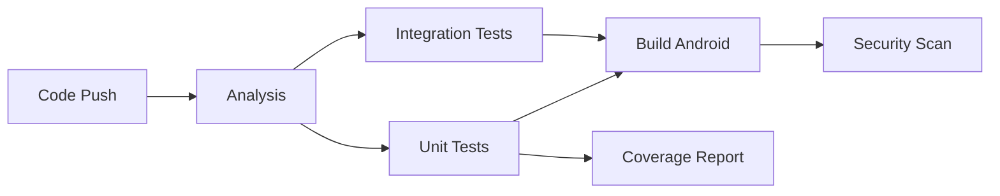

# Testing Guide - TaskFlow Pro

This document describes the testing strategy and how to run tests for TaskFlow Pro.

## 📋 Table of Contents

- [Test Structure](#test-structure)
- [Running Tests](#running-tests)
- [Test Coverage](#test-coverage)
- [Writing Tests](#writing-tests)
- [CI/CD Integration](#cicd-integration)

## 🏗️ Test Structure

### Directory Organization

```
test/
├── services/                    # Unit tests for services
│   ├── todo_service_test.dart
│   ├── prayer_time_service_test.dart
│   └── notification_service_test.dart
├── widgets/                     # Widget tests
│   └── subtasks_widget_test.dart
├── integration/                 # Integration tests
│   └── task_creation_flow_test.dart
├── test_helpers.dart           # Shared test utilities
├── test_date_format.dart       # Date formatting tests
├── test_prayer_times.dart      # Prayer time tests
└── offline_functionality_test.dart  # Offline mode tests
```

### Test Categories

1. **Unit Tests** (`test/services/`)
   - Test individual services in isolation
   - Mock external dependencies
   - Fast execution (~1-2 seconds per test)

2. **Widget Tests** (`test/widgets/`)
   - Test UI components
   - Verify widget rendering
   - Test user interactions

3. **Integration Tests** (`test/integration/`)
   - Test complete user flows
   - Multiple services working together
   - End-to-end scenarios

## 🚀 Running Tests

### Quick Start

```bash
# Run all tests
flutter test

# Run with coverage
flutter test --coverage

# Run specific test file
flutter test test/services/todo_service_test.dart

# Run tests in watch mode (re-run on changes)
flutter test --watch
```

### Using the Test Runner Script

We provide a comprehensive test runner script:

```bash
# Run all tests with coverage and reporting
./scripts/run_tests.sh
```

This script:
- ✅ Cleans previous coverage
- ✅ Runs static analysis
- ✅ Checks code formatting
- ✅ Runs unit and widget tests
- ✅ Runs integration tests
- ✅ Generates HTML coverage report
- ✅ Displays coverage summary

### Running Specific Test Suites

```bash
# Unit tests only
flutter test test/services/

# Widget tests only
flutter test test/widgets/

# Integration tests only
flutter test test/integration/

# Run tests matching a pattern
flutter test --plain-name "TodoService"
```

## 📊 Test Coverage

### Viewing Coverage

After running tests with coverage:

```bash
# Generate HTML report (requires lcov)
sudo apt-get install lcov
genhtml coverage/lcov.info -o coverage/html

# Open in browser
open coverage/html/index.html  # macOS
xdg-open coverage/html/index.html  # Linux
```

### Coverage Goals

| Component | Target | Current |
|-----------|--------|---------|
| Services | 80%+ | 🎯 |
| Widgets | 70%+ | 🎯 |
| Models | 90%+ | 🎯 |
| Overall | 75%+ | 🎯 |

### Coverage Reports

- **Local**: `coverage/html/index.html`
- **CI/CD**: Uploaded to Codecov
- **GitHub**: Coverage badge in README

## ✍️ Writing Tests

### Unit Test Example

```dart
import 'package:flutter_test/flutter_test.dart';
import 'package:shared_preferences/shared_preferences.dart';
import 'package:taskflow_pro/core/services/todo_service.dart';

void main() {
  group('TodoService', () {
    setUp(() async {
      SharedPreferences.setMockInitialValues({});
    });

    test('should add a new task', () async {
      final task = Task(/* ... */);
      await TodoService.addTask(task);

      final tasks = await TodoService.getAllTasks();
      expect(tasks.length, 1);
      expect(tasks.first.title, task.title);
    });
  });
}
```

### Widget Test Example

```dart
import 'package:flutter/material.dart';
import 'package:flutter_test/flutter_test.dart';

void main() {
  testWidgets('should display widget correctly', (WidgetTester tester) async {
    await tester.pumpWidget(
      MaterialApp(
        home: Scaffold(
          body: MyWidget(),
        ),
      ),
    );

    await tester.pumpAndSettle();

    expect(find.text('Expected Text'), findsOneWidget);
  });
}
```

### Integration Test Example

```dart
import 'package:flutter_test/flutter_test.dart';

void main() {
  group('Complete User Flow', () {
    test('should create, update, and delete task', () async {
      // Step 1: Create
      final task = await createTask();

      // Step 2: Update
      await updateTask(task.id);

      // Step 3: Delete
      await deleteTask(task.id);

      // Verify
      expect(await getAllTasks(), isEmpty);
    });
  });
}
```

### Best Practices

1. **Arrange-Act-Assert**: Structure tests in three parts
2. **Descriptive Names**: Use clear, descriptive test names
3. **One Assertion**: Test one thing at a time (when possible)
4. **Setup/Teardown**: Use `setUp()` and `tearDown()` for common setup
5. **Mock Data**: Use SharedPreferences mock for isolated tests

## 🔄 CI/CD Integration

### GitHub Actions Workflow

Our CI/CD pipeline runs automatically on:
- Push to `main` branch
- Push to `claude/**` branches
- Pull requests to `main`

### Pipeline Stages



### What Runs in CI

1. **Code Analysis**
   - `flutter analyze`
   - `dart format --set-exit-if-changed`
   - Dependency checks

2. **Tests**
   - Unit tests with coverage
   - Widget tests
   - Integration tests

3. **Build**
   - Android APK (debug)
   - Android App Bundle (release, main only)

4. **Security**
   - Trivy vulnerability scan
   - Dependency review (PRs only)

5. **Reporting**
   - Coverage upload to Codecov
   - Test summaries
   - Build artifacts

### Manual Workflow Trigger

```bash
# Via GitHub UI: Actions → CI/CD Pipeline → Run workflow

# Via gh CLI
gh workflow run ci.yml
```

## 📈 Test Metrics

### Current Test Suite

- **Total Tests**: 50+
- **Unit Tests**: 30+
- **Widget Tests**: 10+
- **Integration Tests**: 10+

### Execution Time

- **Unit Tests**: ~5 seconds
- **Widget Tests**: ~10 seconds
- **Integration Tests**: ~15 seconds
- **Total**: ~30 seconds

## 🐛 Debugging Tests

### Common Issues

**Issue**: `SharedPreferences not initialized`

**Solution**:
```dart
setUp(() async {
  SharedPreferences.setMockInitialValues({});
});
```

**Issue**: `Null check operator used on a null value`

**Solution**: Ensure all test data is properly initialized

**Issue**: `Test hangs forever`

**Solution**: Use `await tester.pumpAndSettle()` in widget tests

### Running Tests in Debug Mode

```bash
# Run tests with verbose output
flutter test --verbose

# Run single test with debugging
flutter test --plain-name "specific test name"

# Run with coverage and detailed output
flutter test --coverage --reporter expanded
```

## 📚 Resources

- [Flutter Testing Documentation](https://flutter.dev/docs/testing)
- [Effective Dart: Testing](https://dart.dev/guides/language/effective-dart/testing)
- [Widget Testing](https://flutter.dev/docs/cookbook/testing/widget/introduction)
- [Integration Testing](https://flutter.dev/docs/testing/integration-tests)

## 🎯 Next Steps

To improve test coverage:

1. Add tests for remaining widgets
2. Add tests for complex user flows
3. Add performance tests
4. Add accessibility tests
5. Add golden tests for UI consistency

---

**Happy Testing! 🧪**
